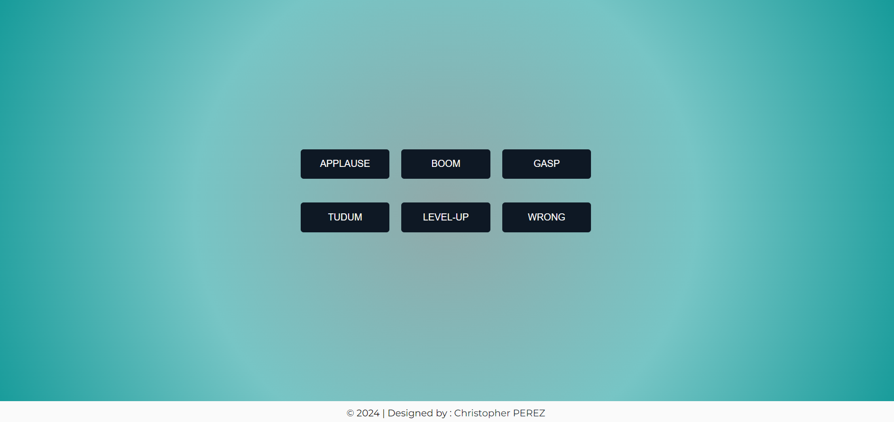

# :flower_playing_cards: Sound Board

Ce projet est un soundboard interactif qui permet de jouer différents effets sonores à l'aide de boutons. Chaque bouton correspond à un son spécifique, et lorsque l'utilisateur clique sur un bouton, le son associé est joué. Si un autre son est joué, le premier est automatiquement arrêté.
Il a été réalisé dans le cadre d'une formation sur [Udemy](https://www.udemy.com/course/50-projects-50-days/).

## Fonctionnalités

- **Boutons interactifs** : Chaque bouton déclenche la lecture d'un son spécifique parmi une liste d'effets sonores.
- **Arrêt automatique des sons** : Lorsqu'un son est en cours de lecture et qu'un autre bouton est cliqué, le premier son est arrêté avant que le nouveau son ne commence.
- **Disposition dynamique des boutons** : Les boutons sont disposés en lignes de 3 pour s'adapter à la largeur de la page, avec un design responsive qui s'ajuste aux écrans de différentes tailles.

### Technologies Utilisées

#### Structure du projet

Ce projet est le neuvième d'une série dans laquelle je me donne l'objectif de perfectionner mes compétences en JavaScript.

- **index.html** : Contient la structure principale du soundboard avec les boutons.
- **style.css** : Gère le style et la mise en page du soundboard, avec un design responsive.
- **script.js** : Contient la logique JavaScript pour gérer les interactions et la lecture des sons.

